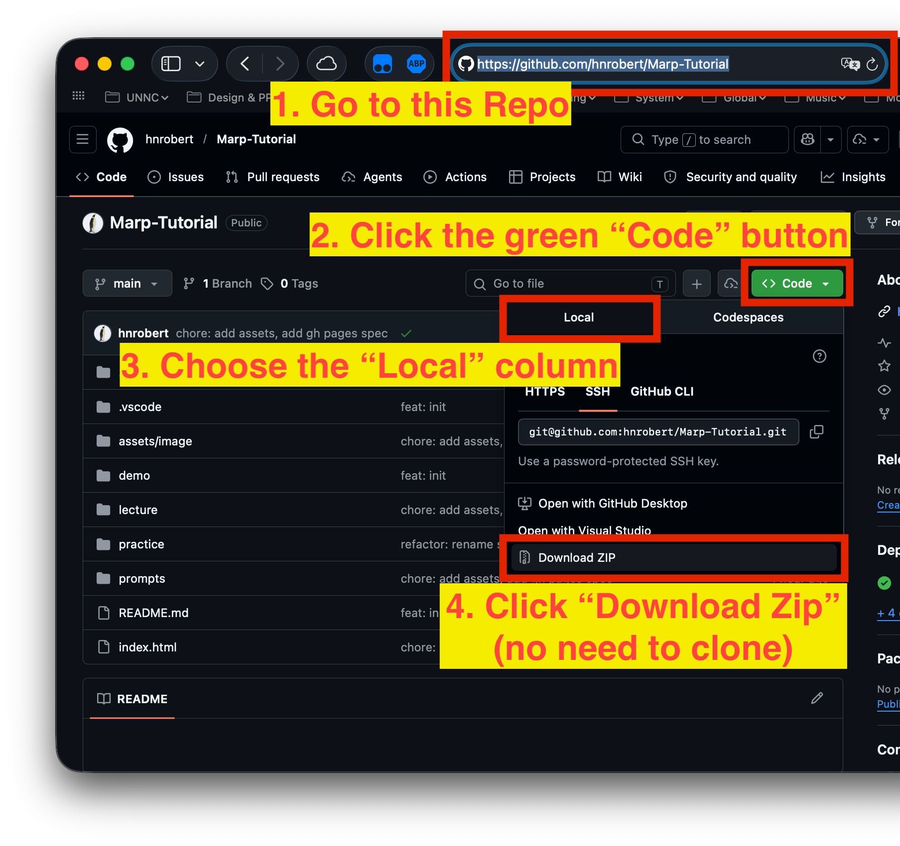
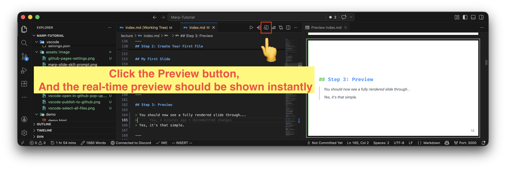
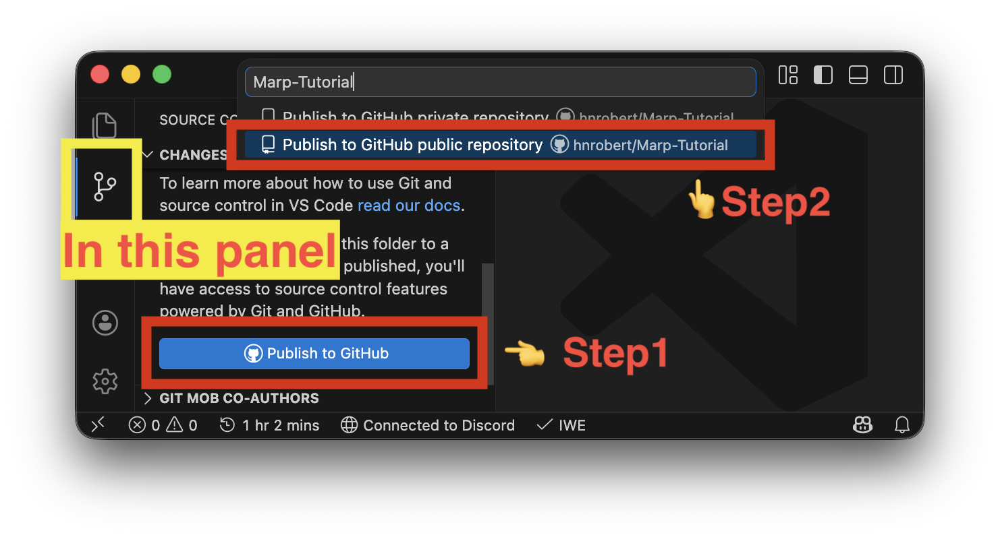
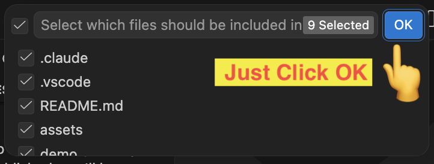
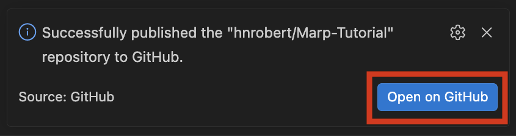
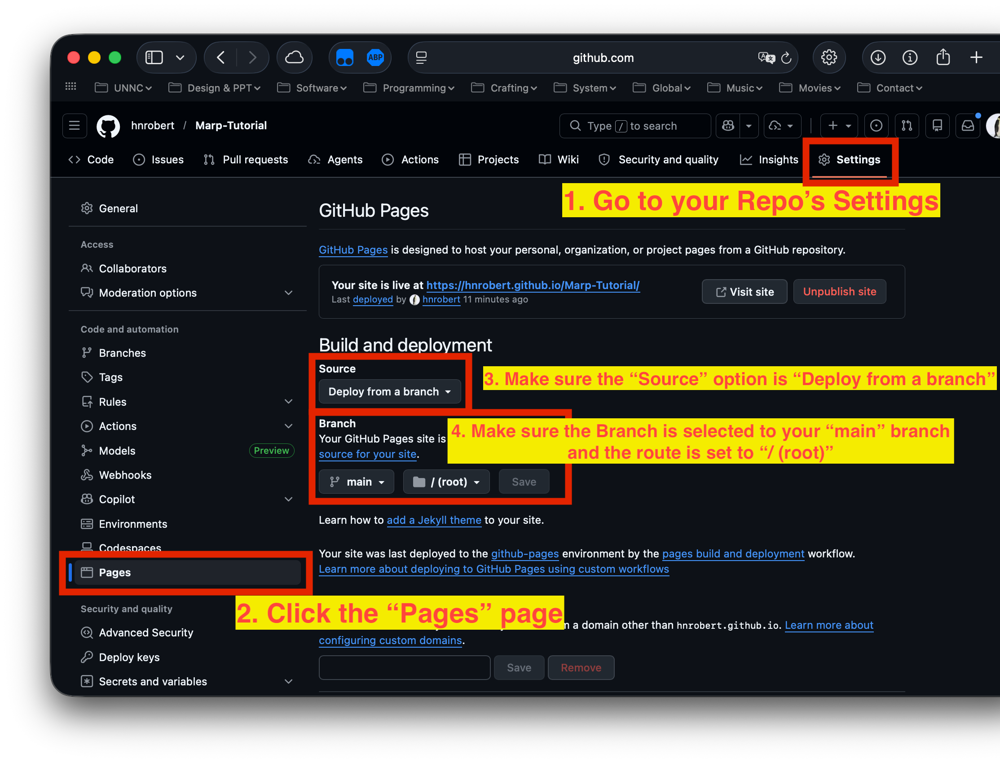
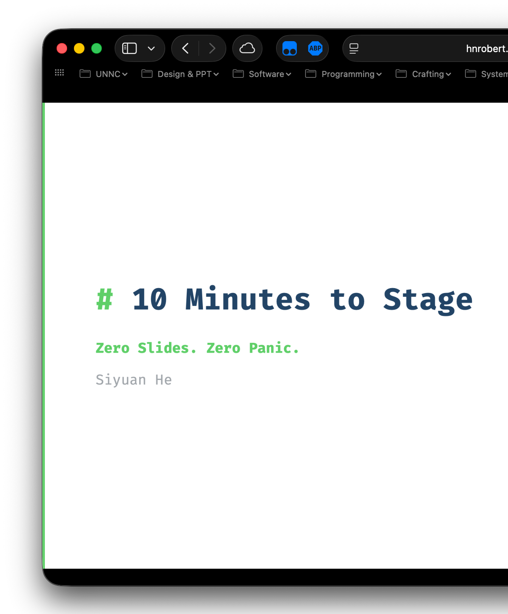

# 60 Minutes to Stage — Course Guide

> **Zero Slides. Zero Panic.**
>
> This guide walks you through the entire lecture: from zero slides to a published presentation, using Marp, AI, and GitHub Pages.

---

## 1. Opening: T-minus 60 Minutes

You're about to present in front of 50 people. Your topic is clear in your head. But you have **no slides**. What do you do?

### Option A: PowerPoint

Open PowerPoint. Pick a template. Drag. Resize. Align. Repeat.

After 10 minutes: you have **2 slides** and a headache.

> The problem isn't the tool. It's the **workflow**.

### Option B: Ask ChatGPT

"Make me a PPT about today's Marp lecture."

You tried again and again, after another 10 minutes: a wall of text, weird formatting, no design, not editable.

> AI can write. But it can't **design slides** well yet.

### The Real Problem

Traditional slide tools require you to:

- **Manually layout** every element
- **Design** color schemes and fonts
- **Repeat** the same formatting for every slide

> This is a **design task**, not a content task.

---

## 2. What If You Could Just Write?

What if you could just **write**, and it automatically becomes slides?

No dragging. No resizing. No design decisions.

Just **text → slides**.

---

## 3. Enter Marp


**Marp** converts Markdown text directly into presentation slides.

### Marp in One Line

```markdown
---
marp: true
---

# My Talk

Speaker Name

---

## A Simple Point

> **Markdown + `---` = Presentation**
```

Every `---` creates a new slide. That's it.

### Why This Changes Everything

- **Write** in plain text — no GUI needed
- **One file** = entire presentation
- **Git-friendly** — track changes like code
- **Export** to PDF, PPTX, HTML, PNG
- **AI can generate it** — it's just text!

---

## 4. Hands-On: Install & Use

### Step 1: Install the Marp Extension

1. Open VSCode
2. Go to Extensions (`Ctrl+Shift+X` / `Cmd+Shift+X`)
3. Search **"Marp for VSCode"**
4. Click **Install** (Author: Marp Team)

> No configuration needed after install.

### Step 2: Create Your First File

Create a new file called `demo.md` and type:

```markdown
---
marp: true
---

# Hello Marp

Your Name

---

## My First Slide

- Point one
- Point two
- Point three
```

### An Easier Approach: Download the Course Materials



1. Go to `hnrobert/Marp-Tutorial` (find it on the Moodle page)
2. Click the green "Code" button
3. Select "Download ZIP"

### Step 3: Preview Your Slides



Save the file and you should see a fully rendered slide preview in VSCode.

> Yes, it's that simple.

### Step 4: Export Your Slides


1. Click the Marp icon in the top right of the editor
2. Select "**Export slide deck...**"
3. Choose format: **PDF / PPTX / HTML / PNG**

> Plain text → Presentation in 3 steps.

---

## 5. Themes & Layouts

### Built-in Themes

Marp has 3 built-in themes:

- **default** — clean white
- **gaia** — modern flat
- **uncover** — minimal

You can also use **custom CSS** for full control. This slide deck uses a custom theme.

### Images & Layouts

Marp supports background images with position and size using ``.

```markdown
## Images & Layouts


Left: text.
Right: image taking 90% of the width.
```

What you see in the code is exactly what you get on screen.

---

## 6. Enter AI: Let AI Write Your Slides

We can write slides in plain text now. But we still need to **write the content**.

Who's going to type 20 slides in 10 minutes?

### AI + Markdown = Natural Fit

AI is **great at generating text**. Markdown is **just text**. So AI can generate an entire slide deck?

### The AI Output Problem

Asking AI to generate slides directly often produces:

- Inconsistent formatting
- Random heading sizes
- Some slides with 2 bullets, some with 15
- No visual coherence
- Different "style" every time

> It works. But it's **unpredictable**.

### What's Going Wrong?

The AI has no idea about:

- How many bullets per slide
- What theme to use
- What CSS looks like
- What "good" slides look like

It's like hiring someone without a **style guide**.

---

## 7. The Solution: Skills

### What Are Skills?

Skills are a mechanism (pioneered by Anthropic) to:

- **Constrain** AI output to specific formats
- **Provide** reference docs and templates
- **Ensure** consistent, reproducible results

> Think of it as a **style guide for AI**, or "**pre-made** prompts".

### How Skills Work

```text
You specify the Skill & describe what you want
            ↓
AI loads templates + rules according to the Skill
            ↓
AI generates within constraints
            ↓
Structured, consistent output
```

**Less randomness. Less negative surprises.**

### The `marp-slide` Skill

Inside the course project at `.claude/skills/marp-slide/`:

- **7 theme CSS files** — ready to use
- **Syntax references** — complete Marp docs
- **Best practices** — quality guidelines
- **Image patterns** — common layouts

> Everything the AI needs to make good slides.

### How to Use It — Specific Steps

1. Let AI read the `SKILL.md` file
2. Ask it to make a slide deck on any topic
3. Direct it to use a specific theme and follow the rules
4. The AI outputs a `.md` file ready to preview and export

---

## 8. Using AI Tools to Generate Slides

### Option A: GitHub Copilot


1. Open the Copilot Chat panel (click the icon in the top right of VSCode)
2. Drag and drop the `SKILL.md` file from `.claude/marp-slide` into the chat input

### Option B: Claude Code


1. Open the `Marp` folder as your VSCode workspace, or `cd` into it in your terminal
2. Open the Claude Code sidebar or launch it in your terminal
3. Type `/marp-slide`

### Writing the Prompt


Describe your content (we've prepared a prompt template for you):

```text
My name: [your name here]

Make a 20-slide presentation introducing marp,
start with why traditional slides are painful,
introduce Marp as the solution,
walk through install/generate/preview/export steps.

Save the output as practice/index.md
```

> You can find this prompt at `prompts/generate-marp.md`. Remember to fill in the placeholder.

### The `@import` Trick

Instead of embedding 200 lines of CSS in every file:

```markdown
<style>
@import '.claude/skills/marp-slide/assets/theme-tech.css';
</style>
```

Clean and reusable. That's exactly how this slide deck does it.

---

## 9. The Real Lesson: It's Not About "Using AI"

**Most people:**

> "AI, make me a PPT" → bad result → "AI doesn't work"

**The problem isn't the AI. The problem is how people use it.**

### The Key Insight

> ~~Make AI smarter~~ **Give AI clearer boundaries**

- A good Skill = a good **job manual**
- Constrain the **freedom**, increase the **consistency**
- Same input → similar quality, every time

### Practical Tips

- **Specify the theme** — "use tech theme"
- **Give a page count** — "around 20 slides"
- **Provide an outline** — list the key points
- **Demand consistency** — "3-5 bullets per slide at most"
- **Iterate** — generate first, then refine

### Beyond Marp

The Skill mindset works everywhere:

- Writing docs → create a doc template Skill
- Writing code → create a code style Skill
- Writing reports → create a report format Skill

> Core idea: **trade freedom for reliability**.

---

## 10. Publish to GitHub Pages

### Step 1: Export as HTML


1. Click the Marp icon in the top right of the editor
2. Select "Export slide deck..."
3. Choose format: **HTML**

### Step 2: Publish to GitHub

1. Go to the **Source Control** panel (`Ctrl+Shift+G`, same on macOS)
2. Click **Publish to GitHub**, and choose the **second option** for a **public repo**



### Step 3: Select All Files

Select all files, then wait a moment for VSCode to initialize the repository.



### Step 4: Mind the Pop-Up

VSCode **initializes, commits & pushes** everything automatically. Click the notification in the bottom right to view your repo on GitHub.



> Your slides are now on GitHub!

### Step 5: Enable GitHub Pages



1. Go to your repository on **github.com**
2. Click the **Settings** tab
3. Scroll to **Pages** in the left sidebar
4. Under "Source", select **Deploy from a branch**
5. Choose **main** branch, folder **/** (root)
6. Click **Save**

> Wait about a minute, then your site will be live at `username.github.io/repo-name`.

---

## 11. Understanding Static Websites

### What Is a Static Website?

A **static website** = files served directly, no server-side code:

- **No backend** — no Python, no PHP, no database
- **No runtime** — files are served as-is
- **Hosting is free** — GitHub Pages, Netlify, Vercel...

```text
Browser requests:  /lecture
GitHub serves:     /lecture/index.html
That's it.
```

> Simple, fast, and free.

### How GitHub Pages Works

GitHub Pages maps your repo to a URL:

```text
your-repo/
├── index.html          → username.github.io/repo/
├── lecture/
│   └── index.html      → username.github.io/repo/lecture
└── practice/
    └── index.html      → username.github.io/repo/practice
```

Every folder with an `index.html` becomes a page. No server config needed.

### Our Homepage: `index.html`



Our `index.html` has **two buttons** — no forms, no input:

```text
[ Lecture ]  →  /lecture
[ Practice ] →  /practice
```

Click a button → navigate to the path. That's what you see at `username.github.io/repo/`.

---

## 12. Resources

| Resource | Link |
|----------|------|
| Marp | <https://marp.app> |
| Marp VSCode Extension | Search "Marp for VSCode" in VSCode |
| Visual Studio Code | <https://code.visualstudio.com> |
| Claude Code | <https://claude.ai/code> |
| This project's Skill | Modified from [skillsmp.com](https://skillsmp.com/skills/davila7-claude-code-templates-cli-tool-components-skills-creative-design-marp-slide-skill-md) |

---

## Summary

**T-minus 0: Ready to Present.**

In this course, you learned:

1. **Marp basics** — write slides with Markdown + `---`
2. **Install & export** — VSCode extension, preview, and export to multiple formats
3. **AI-assisted generation** — use Skills to constrain AI output for consistent slides
4. **Publish online** — host your presentation for free via GitHub Pages

> Core takeaway: don't make AI smarter — give it clearer boundaries. **Trade freedom for reliability.**
