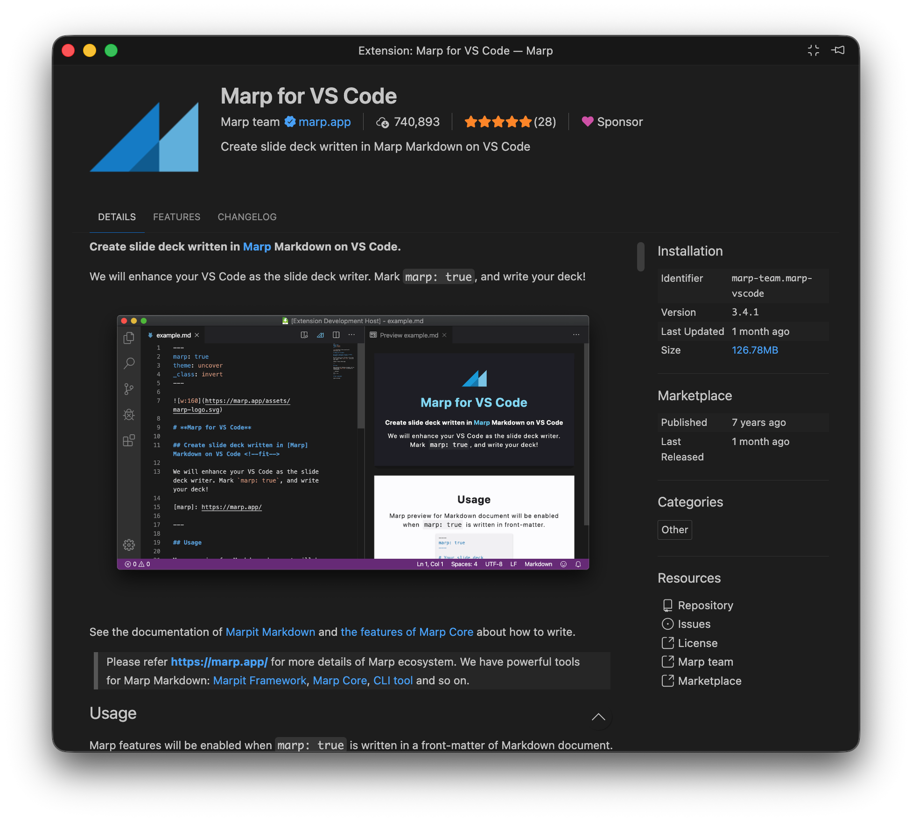
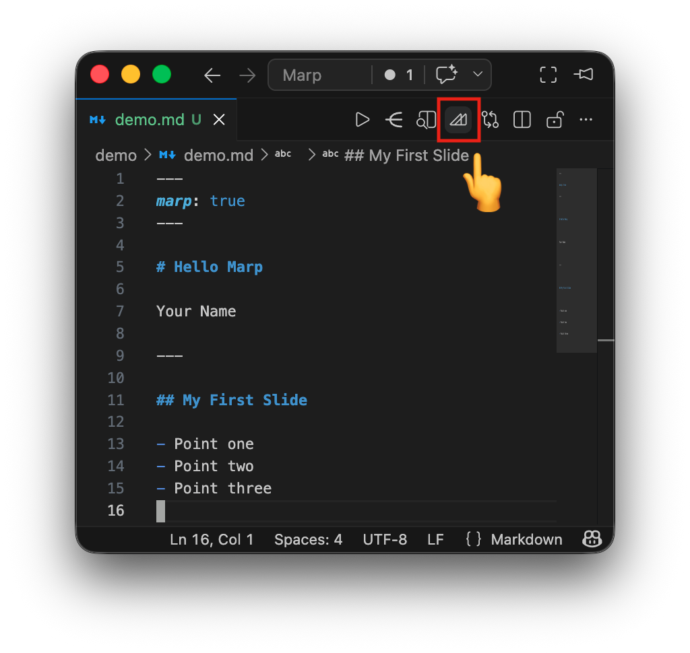
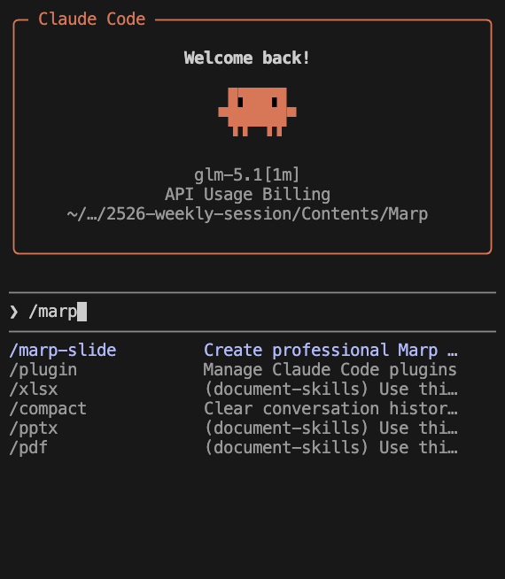
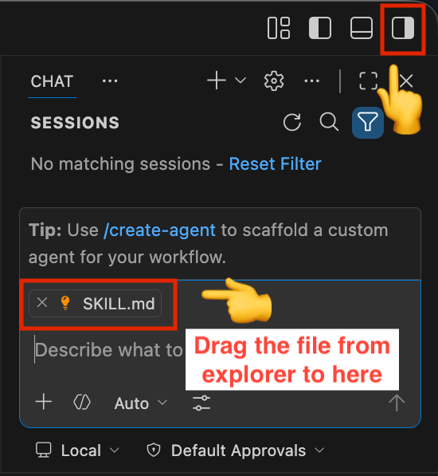
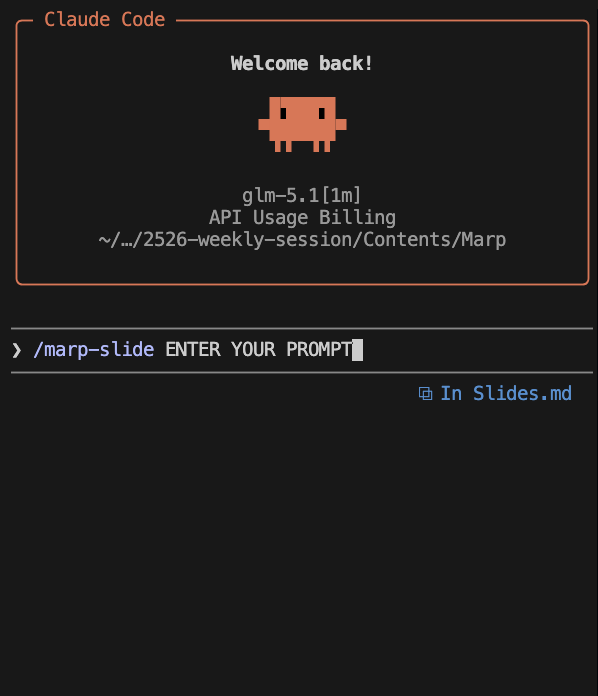

<style>
@import '../.claude/skills/marp-slide/assets/theme-tech.css';
</style>

<!-- _class: lead -->
<!-- _paginate: false -->

# 10 Minutes to Stage

**Zero Slides. Zero Panic.**

Siyuan He

---

## T-minus 10 Minutes

You're about to present in front of 50 people.

Your topic is clear in your head.

But you have **no slides**.

What do you do?

---

## Option A: PowerPoint

Open PowerPoint. Pick a template.

Drag. Resize. Align. Repeat.

> After 8 minutes: you have **2 slides** and a headache.
> The problem isn't the tool. It's the **workflow**.

---

## Option B: Ask ChatGPT

"Make me a PPT about today's Marp lecture."

You get... a wall of text, weird formatting, no design, not editable.

> AI can write. But it can't **design slides** well yet.

---

## The Real Problem

Traditional slide tools require you to:

- **Manually layout** every element
- **Design** color schemes and fonts
- **Repeat** the same formatting for every slide

> This is a **design task**, not a content task.

---

## What If...

What if you could just **write**, and it automatically becomes slides?

No dragging. No resizing. No design decisions.

Just **text → slides**.

---

<!-- _class: lead -->

# Enter Marp



---

## Marp in One Line

```markdown
---
marp: true
---

# My Talk

Speaker Name

---

## A Simple Point

> **Markdown + `---` = Presentation**

```

That's it. Every `---` creates a new slide.

---

## Why This Changes Everything

- **Write** in plain text — no GUI needed
- **One file** = entire presentation
- **Git-friendly** — track changes like code
- **Export** to PDF, PPTX, HTML, PNG
- **AI can generate it** — it's just text!

---

## Let's Get Hands-On

Open VSCode now. Follow along.

> We'll go from zero to slides in 5 minutes.

---

## Step 1: Install Marp Extension

1. Open VSCode
2. Go to Extensions (`Ctrl+Shift+X` / `Cmd+Shift+X`)
3. Search **"Marp for VS Code"**
4. Click **Install** (Author: Marp Team)

> That's it. No config needed.

---

## Step 2: Create Your First File

Create a new file called `demo.md` and type:

```markdown
---
marp: true
---

# Hello Marp

Your Name

---

## My First Slide

- Point one
- Point two
- Point three
```

---

## Step 3: Preview

Press `Ctrl+Shift+V` (Windows) / `Cmd+Shift+V` (Mac)

> You should now see a fully rendered slide.

Yes, it's that simple.

---

## Step 4: Export

<div class="columns">
<div class="column">



</div>
<div class="column">

1. Click the Marp icon in the top right of the markdown workspace
2. Select "Export slide deck..."
3. Choose format:
   **PDF / PPTX / HTML / PNG**

> **Plain text -> Presentation** in 3 steps.

</div>
</div>

---

## Does It Look Good?

Marp has 3 built-in themes:

- **default** — clean white
- **gaia** — modern flat
- **uncover** — minimal

And you can use **custom CSS** for anything.

> Like this slide deck — it's all custom CSS.

---

## Images & Layouts

```markdown
## Key Insight


- Marp converts Markdown to slides
- AI generates the content
- Skills ensure consistent quality
```

Left: text. Right: image. One line of code.

---

## So Now We Have Marp

We can write slides in plain text.

But... we still need to **write the content**.

> Who's going to type 30 slides in 8 minutes?

---

<!-- _class: lead -->

# Enter AI

---

## AI + Markdown = Natural Fit

AI is **great at generating text**.

Markdown is **just text**.

So AI can generate an entire slide deck?

> Let's try it.

---

## The AI Output Problem

"Hey Claude, make me 30 slides about this Marp lecture."

Result:

- Inconsistent formatting
- Random heading sizes
- Some slides have 2 bullets, some have 15
- No visual coherence
- Different "style" every time

> It works. But it's **unpredictable**.

---

## What's Going Wrong?

The AI has no idea about:

- How many bullets per slide
- What theme to use
- What CSS looks like
- What "good" slides look like

It's like hiring someone without a **style guide**.

---

<!-- _class: lead -->

# What Shall We Do?

---

## What If AI Had a "Job Manual"?

Imagine giving the AI:

- **Templates** — predefined structures
- **Rules** — "3-5 bullets per slide"
- **Theme files** — CSS it can reference
- **Quality checks** — standards to meet

> This is what **Skills** are.

---

## What Are Skills?

Skills are a mechanism (pioneered by Anthropic) to:

- **Constrain** AI output to specific formats
- **Provide** reference docs and templates
- **Ensure** consistent, reproducible results

> Think of it as a **style guide for AI**
> or "**pre-made** prompts"

---

## How Skills Work

```text
You specify the Skill & describe what you want
            ↓
AI loads templates + rules according to the Skill
            ↓
AI generates within constraints
            ↓
Structured, consistent output
```

**Less randomness & Less negative surprises.**

---

## The `marp-slide` Skill

In this project's `.claude/skills/marp-slide/`:

- **7 theme CSS files** — ready to use
- **Syntax references** — complete Marp docs
- **Best practices** — quality guidelines
- **Image patterns** — common layouts

> Everything the AI needs to make good slides.

---

## How to Use It? Specific Steps?

1. Let AI read the `SKILL.md` file
2. Ask it to make a slide deck on any topic
3. Direct it to use a specific theme and follow the rules
4. The agent will output a `.md` file ready to preview and export

> Generally, let AI read the Skill, pick a theme, follow the rules, and output a `.md` file.

---

## Claude Code Instructions



1. Open the `Marp` folder as your vscode workspace / `cd` into it in your terminal
2. Open Claude Code sidebar /
   in your terminal
3. Type `/marp-slide`

---

## GitHub Copilot



1. Open the Copilot Chat panel, if not opened, click the icon in the top right of VSCode
2. Drag and drop the `SKILL.md` file from the `marp-slide` folder to the chat input

---

## The Prompt



Describe your content (we've prepared a prompt for you):

```text
/marp-slide
Make a 15-slide presentation about
"How to use Marp + AI to make slides"
using the tech theme.
```

---

## What Happens Behind the Scenes

AI will:

1. Load the tech theme CSS via `@import`
2. Structure content with proper headings
3. Keep proper number of bullets per slide
4. Gradually generate a complete `.md` file

---

## The `@import` Trick

Instead of embedding 200 lines of CSS in every file:

```markdown
<style>
@import '.claude/skills/marp-slide/assets/theme-tech.css';
</style>
```

Clean & Reusable.

> That's exactly how this slide deck does.

---

<!-- _class: lead -->

# The Real Lesson

## It's Not About "Using AI"

**Most people:**

> "AI, make me a PPT" → bad result → "AI doesn't work"

**The problem** isn't the AI.
The problem is **how people use it**.

---

## The Key Insight

> ~~Make AI smarter~~ **Give AI clearer boundaries**

- A good Skill = a good **job manual**
- Constrain the **freedom**, increase the **consistency**
- Same input → Similar quality, every time

---

## Practical Tips

- **Specify the theme** — "use tech theme"
- **Give a page count** — "around 15 slides"
- **Provide an outline** — list the key points
- **Demand consistency** — "3-5 bullets per slide"
- **Iterate** — generate first, then refine

---

## Beyond Marp

The Skill mindset works everywhere:

- Writing docs → create a doc template Skill
- Writing code → create a code style Skill
- Writing reports → create a report format Skill

> Core idea: **trade freedom for reliability**.

---

## Try to export your slides as HTML this time

<div class="columns">
<div class="column">


</div>
<div class="column">

1. Click the Marp icon in the top right of the markdown workspace
2. Select "Export slide deck..."
3. Choose format:
   **HTML**

> Believe it or not, it would be useful for you, soon enough ;)

</div>
</div>

---

## Step 6: Publish to GitHub

VSCode does everything in one click:

1. Go to **Source Control** panel (`Ctrl+Shift+G`)
2. Click **Publish to GitHub**
3. Choose **Public** repository, sign in if needed
4. Confirm — VSCode initializes, commits & pushes automatically

> Your slides are now on GitHub!


---

## Step 7: Enable GitHub Pages

1. Go to your repository on **github.com**
2. Click **Settings** tab
3. Scroll to **Pages** in the left sidebar
4. Under "Source", select **Deploy from a branch**
5. Choose **main** branch, folder **/ (root)**
6. Click **Save**

> Wait a minute (literally), then your site is live at `username.github.io/repo-name`

---

## About Static Websites

A **static website** = files served directly, no server code:

- **No backend** — no Python, no PHP, no database
- **No runtime** — files are served as-is
- **Hosting is free** — GitHub Pages, Netlify, Vercel...

```text
Browser requests:  /lecture
GitHub serves:     /lecture/index.html
That's it.
```

> Simple, fast, and free.

---

## How GitHub Pages Works

GitHub Pages maps your repo to a URL:

```text
your-repo/
├── index.html          → username.github.io/repo/
├── lecture/
│   └── index.html      → username.github.io/repo/lecture
└── practice/
    └── index.html      → username.github.io/repo/practice
```

Every folder with an `index.html` becomes a page.
No server config needed.

---

## Our Homepage: `index.html`

Our `index.html` has **two buttons** — no forms, no input:

```text
[ Lecture ]  →  /lecture
[ Practice ] →  /practice
```

Click a button → navigate to the path.
Plus a brief explanation of how static websites work.

> That's the homepage you'll see at `username.github.io/repo/`.

---

## Resources

- Marp: <https://marp.app/>
- Marp VSCode Extension: search "Marp for VS Code"
- Visual Studio Code: <https://code.visualstudio.com/>
- Claude Code: <https://claude.ai/code>
- This project's Skill: `.claude/skills/marp-slide/`

---

<!-- _class: lead -->
<!-- _paginate: false -->

# T-minus 0: Ready to Present

## **Q & A**
